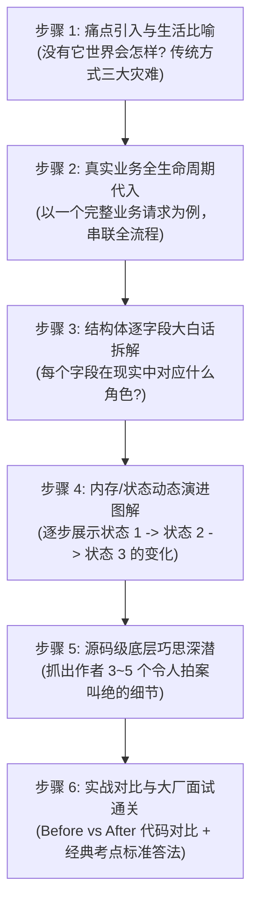

# 循序渐进式源码与架构解析教学规范 (Progressive Codebase Pedagogy)

本规范为 AI 助手（Antigravity、Claude、OpenAI 等）在向开发者讲解任何复杂开源项目（如 NGINX、Redis、Linux 内核、Netty 等）或低级数据结构与系统架构时的**强制执行教学方法论**。

---

## 🚫 核心禁忌（Anti-Patterns）

1. **严禁“概念轰炸”**：绝不能假设读者已经精通该项目。严禁一上来就抛出几十行冰冷的结构体定义或一堆生僻的名词缩写。
2. **严禁“脱离运行时”**：绝不能孤立地静态解释结构体，必须将其置于系统真实的生命周期流动中。
3. **严禁“浮于表面”**：不能只说“它为了高性能”，必须讲透它在字节层面、汇编/系统调用层面到底通过什么巧妙操作实现了高性能。

---

## 🎯 标准教学交付六步法（The 6-Step Pedagogical Workflow）

当用户要求解析某个项目、模块或数据结构时，必须严格按以下 6 个步骤展开：

---

### 步骤 1：现实痛点引入与通俗生活比喻（Problem-First Storytelling）
- **痛点还原**：以极限高并发/极限场景为背景，详细列出如果使用朴素/传统方式（如 `malloc/free`、多线程竞争、轮询等）会面临的 **三大致命灾难**。
- **生活比喻**：引入一个恰当的生活映射（如“桌边大垃圾袋”、“快递中转站分拣”），让读者在 10 秒内建立直觉认知。
- **一句话哲学**：提炼该组件的核心设计哲学（如“生命周期绑定，化零为整”）。

---

### 步骤 2：真实业务全生命周期代入（Runtime Lifecycle Walkthrough）
- **绝对拒绝静态孤立讲解**！必须挑选一个读者最容易理解的典型运行时路径（例如：客户端发起 TCP 握手 $\rightarrow$ 发送 HTTP 请求头 $\rightarrow$ 读取大文件 $\rightarrow$ 响应完成 $\rightarrow$ 连接复用）。
- 使用 **时序图（Mermaid Sequence Diagram）** 标注每个阶段该数据结构经历了什么操作（创建、切分、扩容、挂载、重置、销毁）。

---

### 步骤 3：结构体逐字段大白话拆解（Plain-Language Deconstruction）
- 贴出核心结构体代码，但**必须为每一个关键字段提供接地气的中文业务注释和形象 emoji**。
- 解释为什么字段要这样组合（例如：为什么分成小头和大头？为什么某些字段不需要指针？）。

---

### 步骤 4：分步动画式内存/状态演变图解（Step-by-Step State Diagrams）
- 至少展示 3~4 个关键状态转换的图解：
  1. **初始状态**：刚创建时各指针指向哪里。
  2. **常规操作状态**：正常工作（如指针偏移、插入）时的内存/状态变化。
  3. **边界与扩容状态**：空间不足或发生冲突时的处理方式。
  4. **大对象/特殊场景状态**：不同分支的处理逻辑。
- 清晰标注指针位移前后、剩余可用空间及内存布局。

---

### 步骤 5：源码级底层巧思深潜（Deep Architectural Ingenuities）
挖掘源码中常人容易忽略但极为精妙的 3~6 个底层设计细节。包括但不限于：
1. **防止退化技巧**（如计数器跳表防 $O(N)$ 遍历、快速位运算取代模运算）；
2. **零系统调用优化**（如暴力拨回指针的重置复用、批量系统调用合并）；
3. **C 语言模拟高级特性**（如侵入式链表反向计算地址、清理链表实现 RAII 自动析构）；
4. **内存与 CPU Cache 优化**（如对齐计算、紧凑布局、避免跨 Cache Line）。

---

### 步骤 6：实战对比与大厂面试通关（Code Comparison & Interview Mastery）
1. **实战代码对比（Before vs After）**：
   - 给出 ❌ 传统实现（繁琐、易出错、易泄漏）与 ✅ 框架实现（优雅、安全、高效）的代码直观对比。
2. **一句话本质定性**：给出一个高度概括的技术定义。
3. **高频面试攻防真题**：
   - 精选 3~5 道大厂高频面试深度追问；
   - 提供直接击中底层要害的满分回答模板。

---

## 🌟 执行标准检查清单（Self-Correction Checklist）

在输出任何教学/解析文档前，执行自我审查：
- [ ] 我是否从现实痛点出发，而不是一上来贴结构体？
- [ ] 我是否给出了形象贴切的生活比喻？
- [ ] 我是否带入了系统实际的请求全生命周期流程？
- [ ] 我是否画出了内存/状态在不同步骤下的演变图？
- [ ] 我是否解释了每个字段的通俗含义与关键宏/边界条件？
- [ ] 我是否提供了清晰的代码对比和面试要点？
