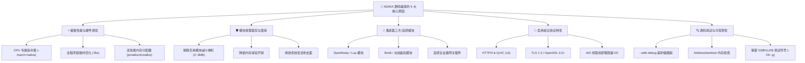
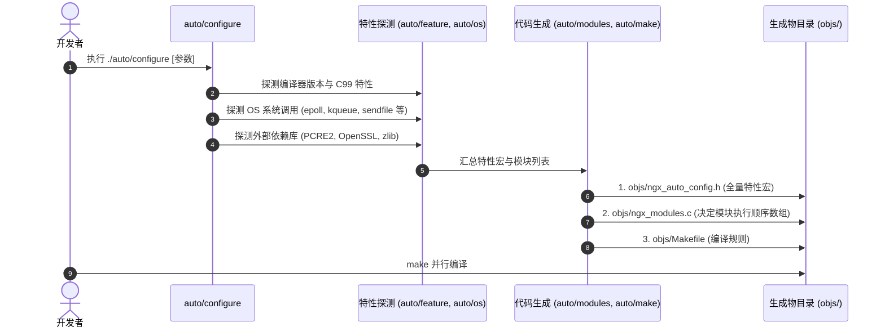

# 01. NGINX 编译构建体系与排错全解

---

## 🎯 1. 为什么必须/推荐从源码编译 NGINX？

相比直接使用系统的二进制包（如 `apt install nginx` 或 `yum install nginx`），从源码编译是生产高性能优化与二次开发的标准姿势：



---

## 🛠️ 2. NGINX 自研构建系统的设计哲学

NGINX 没有采用 `CMake` 或 GNU `Autotools`，而是使用由作者 Igor Sysoev 纯手工编写的基于 POSIX Shell 的 [`auto/`](file:///Users/robot/code/nginx/auto) 脚本体系。



### 核心机制精粹：
1. **零外部构建依赖**：仅依赖基础 `/bin/sh`，无需 Python/CMake 等复杂环境。
2. **真实试编测试（Feature Probing）**：在 [`auto/feature`](file:///Users/robot/code/nginx/auto/feature) 中通过现场生成微型 C 代码调用 `cc` 编译测试，而非仅靠系统版本字符串判断。
3. **固化模块执行拓扑（`ngx_modules.c`）**：HTTP 过滤链（Filter Chain）是单向链表，执行顺序由 [`auto/modules`](file:///Users/robot/code/nginx/auto/modules) 输出到 `objs/ngx_modules.c` 的物理数组顺序严格固化，消除运行时查表开销。
4. **预编译宏消除运行时分支**：探测结果全部写入 [`objs/ngx_auto_config.h`](file:///Users/robot/code/nginx/objs/ngx_auto_config.h)，源码通过 `#if (NGX_HAVE_EPOLL)` 条件编译，运行时零多余分支判断。

---

## 🚨 3. 编译失败实战分析与排错（以 PCRE/PCRE2 为例）

### 报错现象：
```text
checking for PCRE2 library ... not found
checking for PCRE library ... not found
...
./auto/configure: error: the HTTP rewrite module requires the PCRE library.
```

### 根本原因剖析：
1. NGINX 默认启用 [`ngx_http_rewrite_module`](file:///Users/robot/code/nginx/src/http/modules/ngx_http_rewrite_module.c)（URL 重写与重定向），该模块强依赖 **PCRE / PCRE2** 正则库。
2. 查看 [`objs/autoconf.err`](file:///Users/robot/code/nginx/objs/autoconf.err) 发现，Clang 试编 `#include <pcre2.h>` 时报错 `fatal error: 'pcre.h' file not found`，系统默认搜索路径缺少该库的头文件与动态库。

### 解决方案：
- **方案 A（快速验证/无需外部依赖）**：
  ```bash
  ./auto/configure --without-http_rewrite_module
  make -j$(nproc 2>/dev/null || sysctl -n hw.ncpu)
  ```
- **方案 B（全功能生产配置，注入 Homebrew 路径）**：
  ```bash
  brew install pcre2 openssl@3 zlib
  ./auto/configure \
      --with-debug \
      --with-http_ssl_module \
      --with-http_v2_module \
      --with-http_stub_status_module \
      --with-http_gzip_static_module \
      --with-cc-opt="-I/opt/homebrew/opt/pcre2/include -I/opt/homebrew/opt/openssl@3/include" \
      --with-ld-opt="-L/opt/homebrew/opt/pcre2/lib -L/opt/homebrew/opt/openssl@3/lib"
  make -j$(sysctl -n hw.ncpu)
  ```
