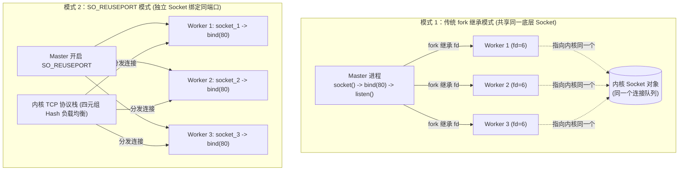
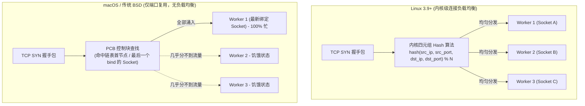

# 02. 多进程端口监听与 SO_REUSEPORT 跨平台机制

---

## 🧱 1. 多进程监听同一端口的两种模式

在 NGINX 中，多个 Worker 进程可以通过两种完全不同的方式监听同一个服务端口（如 80 或 443）：

### 模式 1：经典 fork 继承模式（默认模式）
- **实现机制**：Master 进程先创建 Socket 并 `bind`+`listen`，随后 `fork()` 出 Worker 进程。根据 POSIX 标准，所有子进程继承父进程打开的文件描述符（`listen_fd`）。
- **挑战与解决**：所有 Worker 在同一个 Socket 上竞争 accept，早期会引发“惊群（Thundering Herd）”效应。NGINX 在应用层设计了 **`accept_mutex`（全局共享互斥锁）** 来让 Worker 轮流接客。

### 模式 2：`SO_REUSEPORT` 独立套接字模式（现代高性能模式）
- **配置指令**：`listen 80 reuseport;`（源码位于 [`ngx_connection.c:486`](file:///Users/robot/code/nginx/src/core/ngx_connection.c#L486)）。
- **实现机制**：每个 Worker 分别持有独立的 Socket fd 并绑定到同一个端口，由内核网络协议栈直接完成连接分流。
- **优势**：消灭惊群、消除应用层互斥锁竞争，多核网络吞吐大幅提升。

---

## ⚖️ 2. Linux 与 macOS/传统 BSD 的行为深度对比

许多人误以为只要支持 `SO_REUSEPORT`，各系统的表现就是一致的，**但实际上两者的设计目的与内核调度行为存在本质差异**：

| 维度 | Linux `SO_REUSEPORT` (3.9+) | macOS (Darwin) `SO_REUSEPORT` | FreeBSD 12+ (`SO_REUSEPORT_LB`) |
| :--- | :--- | :--- | :--- |
| **设计初衷** | **多进程/多核 TCP 负载均衡**（Socket 分片，消灭锁争用与惊群） | **允许相同 UID 绑定同端口**（主要用于 UDP 组播/广播或快速重启） | 修复传统 BSD 无法负载均衡的问题，专门新增 `_LB` 标志 |
| **TCP 连接分发算法** | **四元组哈希算法（4-tuple Hash）**：连接极其均匀地散列到各个 Worker | **无负载均衡算法**：按 PCB 链表固定匹配（通常全部倒给最后或最先 bind 的 Socket） | 支持内核轮询（Round-Robin）或哈希负载均衡 |
| **多进程并发表现** | 各 Worker CPU 负载近乎 **1:1 绝对平稳** | **严重偏斜与饥饿**：一个 Worker 承接绝大多数流量，其余 Worker 闲死 | 各 Worker 负载均衡 |
| **可编程扩展** | 支持 **eBPF** 挂载（`SO_ATTACH_REUSEPORT_EBPF`）自定义分流规则 | 不支持 | 不支持 |

### 源码佐证：
在 [`src/core/ngx_connection.c:283`](file:///Users/robot/code/nginx/src/core/ngx_connection.c#L283) 中，NGINX 针对 FreeBSD 专门使用了 `#ifdef SO_REUSEPORT_LB`，而 macOS (Darwin) 至今没有类似实现。

### 🏁 工程落地准则：
- **Linux 生产环境**：强烈推荐开启 `reuseport`。
- **macOS 本地环境**：开发测试无妨，但不应依赖 `reuseport` 压测多进程负载均衡，应使用默认的 Master 继承共享 Socket 模型。
