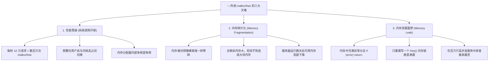
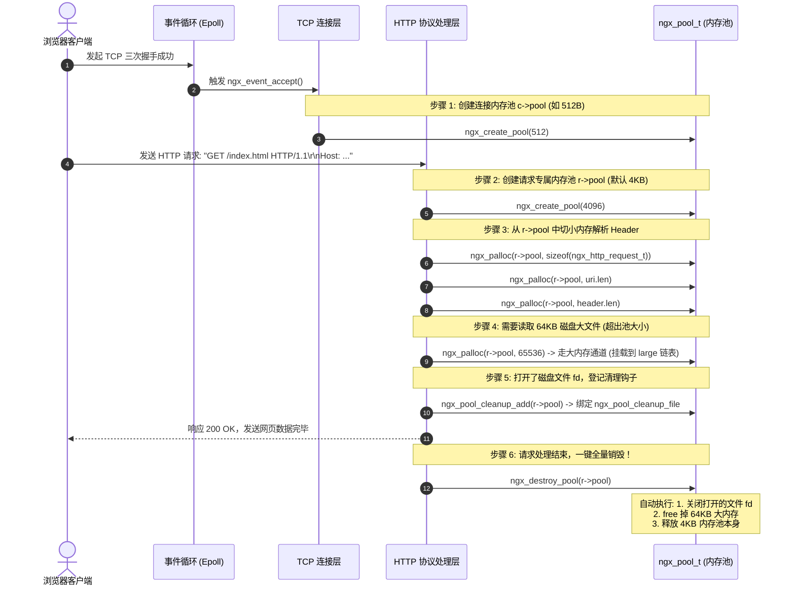
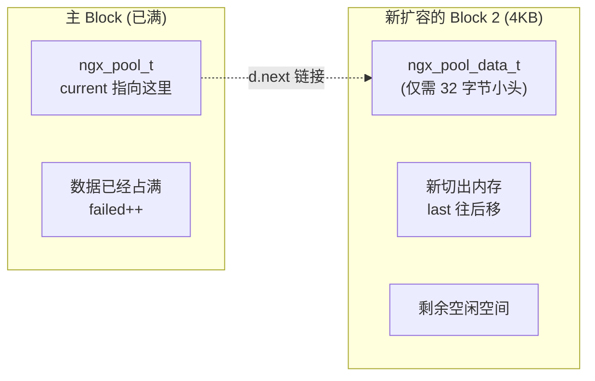
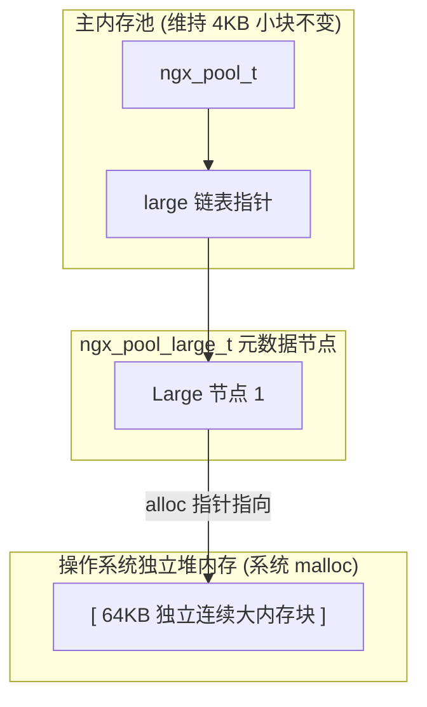

# 03. 彻底搞懂 NGINX 核心：ngx_pool_t 内存池全景剖析

> **写在前面**：  
> 如果你刚接触 NGINX 源码，看到 `ngx_pool_t` 里一堆指针和结构体嵌套可能会觉得抽象晦涩。  
> 本文**摒弃纯概念堆砌**，从 **“为什么需要它”** 入手，结合 **一个真实 HTTP 请求从来到走的完整生命周期**，带你一步步推导并彻底掌握 NGINX 内存池的设计精髓。

---

## 🧭 学习脉络导航


---

## 一、 现实痛点：如果用传统 C 语言写 Web 服务器会发生什么？

在 C 语言中，我们通常用 `malloc()` 分配内存，用 `free()` 释放内存。  
想象一下：**NGINX 作为一个高性能 Web 服务器，每秒要处理 100,000 个 HTTP 请求**。

### 场景还原：处理一个普通 HTTP 请求需要分配哪些内存？
1. 读取客户端发送的第一行，分配 100 字节存 URL；
2. 读取 HTTP Header，分配 20 个小结构体分别存 `Host`、`User-Agent`、`Cookie` 等；
3. 解析请求参数，分配 50 字节；
4. 准备向上游服务器转发，分配 200 字节上下文；
5. 读取后端响应，分配 4KB 缓冲区...

一个请求处理下来，程序需要调用 **几十次 `malloc()`**，处理完又要调用 **几十次 `free()`**。

### 🚨 这会带来三个致命灾难：



---

## 💡 二、 通俗生活比喻：从“吃零食”到“打包扔垃圾”

为了解决上述三大痛点，NGINX 的作者 Igor Sysoev 提出了内存池的设计：

| 传统模式（`malloc` / `free`） | NGINX 内存池模式（`ngx_pool_t`） |
| :--- | :--- |
| 🧑‍🍳 **买一件零食，扔一个包装袋** | 🗑️ **在桌边套一个大垃圾袋（创建内存池）** |
| 每次吃一颗糖（分配 10 字节），就专门跑一趟下楼去垃圾桶扔糖纸（调用一次 `free`）。 | 吃零食时产生的所有果皮、纸屑，直接随手扔进大垃圾袋（只管分配）。 |
| 一天要下楼跑上千次（频繁系统调用），而且很容易随手把糖纸落在沙发缝里找不到（内存泄漏）。 | 吃完准备离开时，**直接把大垃圾袋打个结，整袋一次性扔掉（`ngx_destroy_pool` 一锅端）**！ |

> 📌 **核心设计哲学**：  
> **把具有相同生命周期的微小内存对象绑定在一起。申请时只管切，结束时一锅端，彻底消灭内存碎片和内存泄漏！**

---

## 🔄 三、 实战代入：一个 HTTP 请求的全生命周期中，内存池是如何工作的？

让我们跟着一个真实的 HTTP 请求，看看内存池是如何从创建、使用到销毁的：



---

## 🧩 四、 揭开面纱：`ngx_pool_t` 结构体每个字段到底在干什么？

我们来看源码定义（位于 [`src/core/ngx_palloc.h`](file:///Users/robot/code/nginx/src/core/ngx_palloc.h#L49-L65)），配合白话注释拆解：

### 1. 节点数据区元数据：`ngx_pool_data_t`
每一个具体的内存块（Block）都有这 4 个指针/变量来管理当前的可用空间：

```c
typedef struct {
    u_char               *last;    // 📍【当前已分配的末尾】：新申请内存就从 last 这里开始切
    u_char               *end;     // 🛑【当前 Block 的绝对终点】：不能超过 end
    ngx_pool_t           *next;    // 🔗【指向下一个 Block 的指针】：当前块满了，就顺着链表找下一个
    ngx_uint_t            failed;  // ❌【分配失败计数器】：记录当前块有多少次因为空间不够而无法分配
} ngx_pool_data_t;
```

### 2. 内存池主头部：`ngx_pool_s` (`ngx_pool_t`)
整个内存池的**第一个 Block 头部**，承担总管职责：

```c
struct ngx_pool_s {
    ngx_pool_data_t       d;       // 📦【本块的数据管理信息】(包含了上面的 last, end, next, failed)
    size_t                max;     // ⚖️【大小内存分水岭】：小于 max 算小内存，大于 max 算大内存
    ngx_pool_t           *current; // 🎯【快速分配起点】：每次申请小内存，从 current 指向的块开始找
    ngx_chain_t          *chain;   // 缓冲区链表暂存
    ngx_pool_large_t     *large;   // 🏢【大内存挂载链表】：超过 max 的大块内存单独 malloc 后挂在这里
    ngx_pool_cleanup_t   *cleanup; // 🧹【资源清理器链表】：登记需要自动关闭的 fd、删除的临时文件
    ngx_log_t            *log;     // 📝【日志对象】
};
```

---

## 📊 五、 动画式图解：内存是怎么一块块被切出来的？

### 状态 1：刚创建完成一个 4KB 内存池
调用 `ngx_create_pool(4096, log)` 后：

```text
+-----------------------------------------------------------------------------+
| ngx_pool_t 头部管理信息 | 已分配区域 |             剩余空闲可用空间 (Free)           |
+-----------------------------------------------------------------------------+
^                        ^                                                    ^
|                        |                                                    |
p (池起始地址)          p->d.last (当前指针)                                  p->d.end (终点)
```
- `p->d.last` 指向头部结构体之后的位置；
- `p->max` 被计算为 `4096 - sizeof(ngx_pool_t)` 与页面大小的较小值（约 4016 字节）。

---

### 状态 2：分配小内存（`ngx_palloc`）—— 极致的“指针位移法”
业务代码请求分配 128 字节用于存放客户端的 User-Agent：
`void *p1 = ngx_palloc(pool, 128);`

```text
+-----------------------------------------------------------------------------+
| ngx_pool_t 头部 | [User-Agent: 128B] |              剩余空闲可用空间                |
+-----------------------------------------------------------------------------+
                  ^                    ^                                      ^
                  | (返回给业务)        |                                      |
                  p1                   p->d.last (指针直接向后挪 128 字节)     p->d.end
```
> ⚡ **为什么快？**  
> 因为根本不需要复杂的内存空闲链表检索，只需两行代码：  
> `m = p->d.last;`  
> `p->d.last = m + size; return m;`  
> **这只是几个 CPU 寄存器的加法指令，比 `malloc` 快 5~10 倍！**

---

### 状态 3：小内存满了，触发自动扩容（`ngx_palloc_block`）
当连续申请小内存，当前 Block 剩下的空间（`end - last`）不够用了：



1. NGINX 调用 `ngx_memalign` 分配一个跟原 Block **一模一样大小**的新 Block；
2. 新 Block 头部只需要占用更小的 `ngx_pool_data_t`（32 字节）；
3. 将新 Block 挂在链表末尾，并在新 Block 中切出请求的空间。

---

### 状态 4：遇到 64KB 大内存申请（`ngx_palloc_large`）
如果业务需要申请 64KB（`size > pool->max`），比如要缓存一个大图片：


> 💡 **为什么不把大内存直接扩容进小内存池链表？**  
> 如果分配一个 64KB 的 Block 挂进小链表，等这个大对象用完后，这 64KB 空间就会卡在链表里造成巨大浪费。  
> 单独挂在 `large` 链表上，允许在请求还没结束时通过 `ngx_pfree(pool, ptr)` **提前将这 64KB 归还给系统**，而小内存池依然保持小巧紧凑。

---

## 🔬 六、 源码深潜：那些令人拍案叫绝的“底层细节”

### 细节 1：为什么会有 `if (p->d.failed++ > 4)`？
打开 [`src/core/ngx_palloc.c`](file:///Users/robot/code/nginx/src/core/ngx_palloc.c#L201-L205)：
```c
for (p = pool->current; p->d.next; p = p->d.next) {
    if (p->d.failed++ > 4) {
        pool->current = p->d.next;
    }
}
```
- **问题**：如果一个长请求分配了 20 个 Block，前面 15 个都已经几乎塞满了。如果每次申请 100 字节，都要从第 1 个 Block 依次问到第 15 个 Block，就会退化为 $O(N)$ 遍历，浪费 CPU！
- **解法**：每个 Block 只要经历 4 次“有人来申请内存但因为空间不够而失败”，就给它的 `failed` 记一次过。超过 4 次后，`current` 移动指针**直接跳过它，永远不再检查它**！
- **效果**：将每次小内存分配的查找开销牢牢锁定在 $O(1)$ 常数时间。

---

### 细节 2：`cleanup` 资源清理器 —— C 语言里的 RAII（自动析构）
打开 [`src/core/ngx_palloc.h`](file:///Users/robot/code/nginx/src/core/ngx_palloc.h#L34-L38)：
```c
struct ngx_pool_cleanup_s {
    ngx_pool_cleanup_pt   handler;  // 🧹 清理函数指针 (如 ngx_pool_cleanup_file)
    void                 *data;     // 📦 参数数据 (如包含文件描述符 fd 的结构体)
    ngx_pool_cleanup_t   *next;     // 🔗 下一个清理器
};
```
- **实际场景**：处理静态文件请求时，NGINX 用 `open()` 打开了磁盘文件（拿到 `fd`）。
- **痛点**：万一传输中途客户端突然掐断网络，连接异常退出，很容易漏掉 `close(fd)` 导致文件描述符耗尽。
- **NGINX 做法**：
  ```c
  // 打开文件后，立刻在内存池登记一个清理钩子
  ngx_pool_cleanup_t *cln = ngx_pool_cleanup_add(r->pool, sizeof(ngx_pool_cleanup_file_t));
  cln->handler = ngx_pool_cleanup_file; // 绑定关闭文件的回调函数
  ngx_pool_cleanup_file_t *clnf = cln->data;
  clnf->fd = fd;
  ```
  **无论请求是正常结束还是异常中断退出，只要最终调用 `ngx_destroy_pool(r->pool)`，该 `fd` 必定会被自动关闭！**

---

### 细节 3：Keep-Alive 长连接的极致复用 —— `ngx_reset_pool`
在 HTTP/1.1 长连接场景下，一个 TCP 连接可以连续发送 100 个请求。
如果每个请求都 destroy 掉内存池再重新 create，就会有 100 次 `malloc` 4KB 页面和 100 次 `free` 的开销。

NGINX 的做法是调用 [`ngx_reset_pool()`](file:///Users/robot/code/nginx/src/core/ngx_palloc.c#L100-L119)：
1. 释放 `large` 链表的大内存；
2. 遍历所有 Block，直接将 `p->d.last` 指针**暴力重置拨回头部**；
3. 将 `pool->current` 指针重置为第 1 个 Block。
> **结果**：**0 次操作系统内存分配调用**，瞬间复活并重用了整套预热好的内存块！

---

## 📝 七、 传统 C 代码 vs NGINX 内存池 代码实操对比

### ❌ 传统 C 语言写法（痛苦繁琐、极易泄漏）：
```c
int handle_request() {
    char *url = malloc(128);
    char *header = malloc(512);
    FILE *fp = fopen("index.html", "r");
    
    if (url == NULL || header == NULL || fp == NULL) {
        // 任何一处失败，都要小心翼翼检查每一个指针并释放，极容易漏写
        if (url) free(url);
        if (header) free(header);
        if (fp) fclose(fp);
        return -1;
    }
    
    if (do_something_wrong()) {
        // 业务提前退出分支，又得写一堆重复的释放逻辑
        free(url);
        free(header);
        fclose(fp);
        return -1;
    }
    
    // 正常结束释放
    free(url);
    free(header);
    fclose(fp);
    return 0;
}
```

### ✅ NGINX 内存池写法（优雅清爽、绝对安全）：
```c
ngx_int_t ngx_handle_request(ngx_http_request_t *r) {
    // 1. 从请求池中分配内存，完全不用管怎么 free
    char *url = ngx_palloc(r->pool, 128);
    char *header = ngx_palloc(r->pool, 512);
    
    // 2. 注册文件自动关闭清理器
    ngx_pool_cleanup_t *cln = ngx_pool_cleanup_add(r->pool, sizeof(ngx_pool_cleanup_file_t));
    cln->handler = ngx_pool_cleanup_file;
    // ...
    
    if (do_something_wrong()) {
        return NGX_ERROR; // 直接返回！r->pool 销毁时会自动释放全部内存并关闭文件！
    }
    
    return NGX_OK;
}
```

---

## 🎯 八、 总结与面试通关必备

### 1. 一句话总结 `ngx_pool_t` 的本质
> **`ngx_pool_t` 是一个生命周期绑定型、大小对象分流的层级化连续内存分配器，通过单向移动指针分配小内存、一键全量销毁（Bulk Free），兼具极高吞吐与绝对的内存安全。**

### 2. 高频面试考点速答：
- **Q1：为什么小内存池只增不减，不支持单个小对象释放？**  
  *答*：为了极致的性能。支持单对象释放就需要维护空闲链表和合并碎片，这会带来高额 CPU 开销。Web 请求生命周期极短，全量一锅端收益远大于单体细粒度释放。
- **Q2：`pool->max` 的作用是什么？**  
  *答*：大小内存分界线。避免大块内存挤占小块连续 Block，导致小 Block 快速耗尽而产生链表冗长。
- **Q3：`failed` 计数器和 `pool->current` 是为了解决什么问题？**  
  *答*：防止多 Block 链表过长时，每次分配小内存退化为 $O(N)$ 遍历，将分配开销稳定在 $O(1)$。
