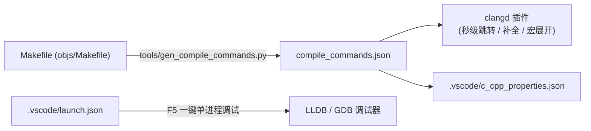

# 04. VS Code 极速开发与断点调试环境指南

---

## 💡 1. 核心架构原理

CMake 项目之所以能在 VS Code 中完美解析，是因为生成了 **`compile_commands.json`（编译命令数据库）**。NGINX 虽基于 Makefile，但通过提取 Dry-run 编译链，我们为项目生成了包含全部 141 个编译单元的精确数据库，配合 Clangd 与 LLDB/GDB，即可获得与现代 IDE 毫无二致的顺滑体验。



---

## 🛠️ 2. 全套配置文件解析

### ① [`.vscode/c_cpp_properties.json`](file:///Users/robot/code/nginx/.vscode/c_cpp_properties.json)
- **编译数据库挂载**：`"compileCommands": "${workspaceFolder}/compile_commands.json"`
- **全局宏注入**：通过 `"forcedInclude"` 显式注入 `objs/ngx_auto_config.h` 和 `objs/ngx_auto_headers.h`，确保 `#if (NGX_HAVE_REUSEPORT)`、`#if (NGX_HAVE_KQUEUE)` 等宏**在编辑器中准确计算真假值，生效分支正常高亮，未生效分支自动变灰**。

### ② [`.vscode/settings.json`](file:///Users/robot/code/nginx/.vscode/settings.json)
- **推荐架构**：`clangd` 负责语法解析、补全与跳转，Microsoft `cpptools` 仅作为底层调试驱动（关闭其语法引擎以防冲突）。

### ③ [`.vscode/tasks.json`](file:///Users/robot/code/nginx/.vscode/tasks.json)
- **`Build NGINX` (默认构建任务)**：快捷键 `Cmd + Shift + B`（Mac）或 `Ctrl + Shift + B`（Linux）直接调用多核 `make`。
- **`Configure NGINX (Debug + Full Modules)`**：一键重新执行全功能 Debug 配置并刷新语法数据库。
- **`Generate compile_commands.json`**：随时重新刷新跳转索引。

### ④ [`.vscode/launch.json`](file:///Users/robot/code/nginx/.vscode/launch.json)
- **一键 F5 启动调试**：针对 macOS（`lldb`）与 Linux（`gdb`）预设了单进程调试环境，自动加载 `conf/nginx.conf`。

---

## 🚀 3. 日常维护与常用命令

1. **当您新增模块或更改 `./auto/configure` 编译参数后**：
   在终端执行以下命令刷新索引：
   ```bash
   python3 tools/gen_compile_commands.py
   ```
2. **重载 VS Code 窗口**：
   按 `Cmd + Shift + P` $\rightarrow$ 执行 `Developer: Reload Window`。
