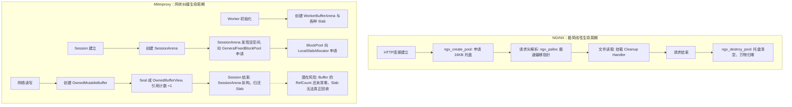
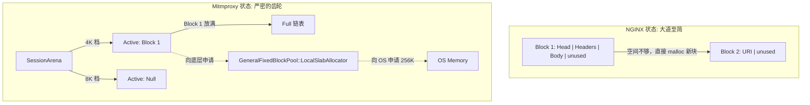

# 深度诊断：NGINX 极简美学 vs Mitmproxy 内存池的“混沌之源”

当你凝视自己写的 `mitmproxy` 内存池代码并感到“混乱”时，你的直觉是极其敏锐的。这种混乱感并非来自于你的代码能力不够（事实上，你的 Slab、Intrusive List 和 Zero-copy 设计非常硬核且精妙），而是来自于**架构生命周期错位**与**过度设计（Over-engineering）**。

我们将严格按照 NGINX 的极简哲学，深度解剖你的 `mitmproxy` 架构，找出“混乱”的根源，并给出一套系统性的方法论。

---

## 1. 痛点与隐喻：为什么你的代码让你感到“混乱”？

### 🌪️ 现实痛点：抽象迷宫与职责越界
在开发高并发服务器时，我们常常陷入一种“工程陷阱”：为了极致性能，把所有高级概念（Slab、引用计数、无锁设计、分代指针）全塞进去。
在你的代码中，如果一个 HTTP 请求要分配一块内存，它需要穿越：
`SessionArena` (Bump) $\rightarrow$ `GeneralFixedBlockPool` (分类) $\rightarrow$ `LocalSlabAllocator` (碎片管理) $\rightarrow$ `OSMemoryAllocator` (mmap)。
**你用管理整个操作系统内存的复杂度，去管理了一个生命周期只有几十毫秒的短连接。**

### 🍔 生活隐喻：快餐托盘 vs 极其复杂的自动化回转寿司
- **NGINX (`ngx_pool_t`)：快餐店的托盘**。顾客进店拿到一个托盘（创建 Pool），汉堡、薯条、可乐直接往上放（Bump 极速分配）。吃完后，保洁员**连托盘带垃圾一次性全部倒掉**（销毁 Pool）。不需要清理每一根薯条。
- **Mitmproxy 内存池：全自动化回转寿司轨道**。你为了吃一顿快餐，设计了复杂的传送带（Slab Allocator）、给每个盘子贴了 RFID 追踪标签（Ref-Counting）、甚至设计了盘子回收与重新洗涤系统（FreeList）。最终吃一顿饭的成本远超食物本身。

---

## 2. 运行时生命周期流转：混乱是如何发生的？

让我们看看一个网络请求到来时，两者的生命周期差异。

**诊断结论 1：** NGINX 是**线性树状生命周期**（Request 死，万物死）。而 Mitmproxy 是**网状图生命周期**（SessionArena 归还了内存，但 Buffer 还在被到处共享，引用计数到处飞）。

---

## 3. 白话结构体解剖：设计理念的碰撞

### 📌 NGINX `ngx_pool_t`
NGINX 的核心思想是**“放弃精确管理，换取绝对速度”**。
- `u_char *last`：当前可用的内存起点。
- `u_char *end`：这块内存的终点。
- `ngx_pool_cleanup_t *cleanup`：挂载需要关闭的 fd 或外部资源。
**没有任何 freelist！没有任何锁！没有任何释放操作！**

### 📌 Mitmproxy 的多重宇宙
你的抽象层级实在太多了：
1. **`SessionArena` (Bump Allocator)**：
   本该和 NGINX 一样简单，但你让它维护了 `active_` 和 `full_` 链表，并且划分了 4 个大小档位（Size Classes）。
2. **`GeneralFixedBlockPool`**：
   为 SessionArena 提供定长块，底层却是一个 **Slab Allocator**。
3. **`OwnedBufferView` & `BufferBlock`**：
   引入了 `ref_count`（引用计数）。你希望实现零拷贝（Zero-copy），让 Buffer 在 Pipeline 中流转。

**诊断结论 2：** Slab Allocator 的核心目的是**复用和防碎片**，它适用于“频繁随机分配和释放”的场景。但 SessionArena 的特性是“生命周期内只分配，不释放”。**在 Bump Allocator 下面垫一个 Slab Allocator，属于严重的架构错位。**

---

## 4. 视觉化状态演进：复杂度的爆发点

让我们看看随着请求的进行，你的 `SessionArena` 是如何演进的，以及为什么它让人感到沉重。

在 NGINX 中，申请内存就是 `last += size`。
在你的代码中，为了在 `SessionArena` 申请 10 字节，你需要：
判断 worst size $\rightarrow$ 计算档位 $\rightarrow$ 扫描 active 链表 $\rightarrow$ 空间不够移入 full $\rightarrow$ 调用 Slab Acquire $\rightarrow$ Slab 可能 FetchBatch $\rightarrow$ 可能向 OS 申请 Slab。

---

## 5. 深度代码级巧思对比与“混沌”诊断

为什么你的代码感觉乱？我们提炼出 **三大设计悖论**：

### 悖论一：用“长寿命”的 Slab 服务“短寿命”的 Session
你的 `SessionArena` 是短连接生命周期。但你向 `GeneralFixedBlockPool` 申请了槽位。
当 Session 结束时，`SessionArena::~SessionArena()` 会循环遍历 4 个档位的 active 和 full 链表，将成百上千的小块逐一 `general_fixed_block_pool_.Return` 回去。
**NGINX 的巧思**：NGINX 的 Block 非常大（通常 16KB），Session 结束时，直接 `free()` 几个大块。甚至在长连接（Keep-Alive）中，NGINX 直接调用 `ngx_reset_pool`，把 `last` 指针拨回起点（0 系统调用），瞬间满血复活！而你的框架在 Session 销毁时需要执行大量的 Slab 链表归还操作，不仅 cache 不友好，而且毫无必要。

### 悖论二：网状生命周期（引用计数） vs 树状生命周期（Pool）
你在 `OwnedBufferView` 中使用了 `IncRef()` 和 `DecRef()`。
由于网络数据包要在 I/O 线程、解析器、业务逻辑之间乱序传递，你害怕指针悬垂，所以用引用计数。
这导致了一个极其可怕的后果：**Session 可能已经销毁了，但 Session 产生的 Buffer 还活着**。你不得不用 `WorkerBufferArena` 去兜底管理这些 Buffer 的寿命，导致对象图变成了复杂的网状结构。
**NGINX 的巧思**：NGINX 绝对禁止这种行为。它要求所有的 Buffer、结构体都依附于 Connection 的 `ngx_pool_t`。如果数据需要跨请求保留，必须显式 copy 到全局 Pool，否则请求结束时强行连根拔起。这逼迫开发者写出极其清晰的所有权语义。

### 悖论三：极致的底层优化与顶层的架构妥协
你的 `SlabAllocator` 甚至考虑了 `color_offset`（缓存行着色，避免 False Sharing）和 `__asan_poison` 内存毒化！这说明你的 C++ 功底极深。
但是，在最顶层的 `BufferChain::TakeFrom` 中，你又写下了这样的注释：
> `arena_ 是「环境引用」，指向它的宿主对象... 两者必须属于同一 arena（内部不变量，调用方责任保证）`
这就是架构失控的标志：**底层做得天衣无缝，但上层逻辑却只能靠开发者的道德和注释来保证（人脑保证同一个 arena）。**

---

## 6. 代码对比与架构重塑方法论

### 重塑方法论：如何消除“混乱感”？

如果你想重构你的项目，解决这种混乱感，你需要遵守以下三大法则：

1. **分离“对象缓存（Object Cache）”与“请求上下文（Arena/Pool）”**
   - **对象缓存**（如 `GenerationalArena`、TCP 连接块）：使用你的 `LocalSlabAllocator`。因为它们生命周期长、大小固定、频繁创建销毁。
   - **请求上下文**（如 HTTP Header 字符串、URI、单次请求的零碎状态）：**废弃 SessionArena 内部的 Slab 依赖**。直接像 NGINX 一样，申请一个 16KB 的大块内存，用完即毁，不要去归还细碎的槽位。

2. **砍掉 Buffer 的引用计数，确立绝对的 Ownership**
   - 绝大多数代理服务器（包括 Envoy）发现，维护 Ref-Counting 带来的心智负担和跨线程 Bug，远大于 Copy 几次内存带来的性能损耗。
   - 方案：引入类似 NGINX `ngx_chain_t` 的简单链表。数据从网卡读入 Worker 专属的巨型 Ring Buffer，解析时直接抛出 `string_view`，如果需要挂起等待，直接 copy 一份。不要在 Session 级别做复杂的零拷贝引用计数传递。

3. **使用 RAII 清理，而不是多层次的析构**
   - 像 NGINX 的 `cleanup` 链表一样。如果一个 Session 申请了外部资源（比如打开了一个 FD），把它挂到 Session 的 Cleanup 链表上。Session 死亡时，统一触发，而不是通过析构函数的层层级联。

### 核心面试问答 (Interview Mastery)

**Q1：为什么在 Bump Allocator（比如 SessionArena）底下垫一个 Slab Allocator 是反模式？**
> **标准回答**：Bump Allocator 的核心优势是分配快（指针加法）且释放快（整体回收，O(1) 复杂度）。而 Slab Allocator 主要是为了解决随机释放带来的内部和外部碎片。在 Session 级别，对象只分配不释放，Slab 的复杂 free-list 维护、cache-line 着色等机制完全成了性能累赘。Session 销毁时，将大量小块逐一 Return 回 Slab 会导致严重的 CPU Cache Miss。

**Q2：Mitmproxy 中 `BufferChain` 使用引用计数的零拷贝机制，为什么会导致架构上的“混乱”？**
> **标准回答**：引用计数破坏了明确的树状生命周期（父生子，父死子灭），将其变成了复杂的网状生命周期。在代理服务器中，当 Session 断开时，理想状态是直接销毁所有资源。但如果 Buffer 使用引用计数，底层内存块可能被 pending 队列、异步定时器等持有，导致内存延迟释放，甚至因为循环引用或某个角落漏了 DecRef 而引发内存泄漏。NGINX 通过强制的 Pool 绑定（强所有权）避免了这个问题。

**Q3：NGINX 的 `ngx_reset_pool` 为什么能被称为“0 系统调用的魔法”？在你的 Mitmproxy 中如何实现？**
> **标准回答**：在长连接场景下，NGINX 处理完一个 HTTP 请求后，无需 `free` 内存，直接调用 `ngx_reset_pool`，将当前 Pool 所有 block 的 `last` 指针直接移回 `sizeof(ngx_pool_t)` 的位置。下次请求直接覆盖旧内存，无需任何 OS 系统调用。
在现有的 Mitmproxy 中无法实现，因为 `SessionArena` 分配的对象由底层 Slab 管理，必须逐个归还以维持 free-list 状态。若要改造，需移除 Session 层的 Slab 依赖，退化为纯正的大块连续内存 Bump 机制。
