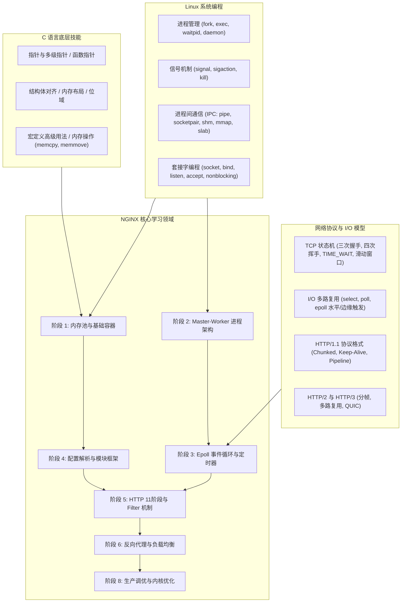
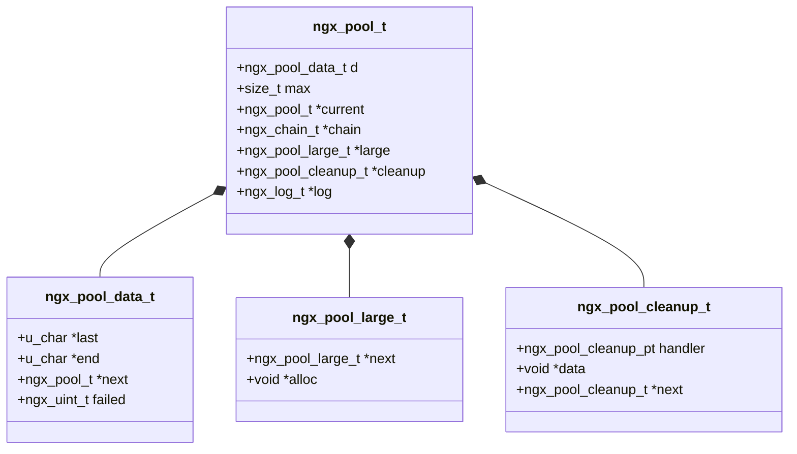
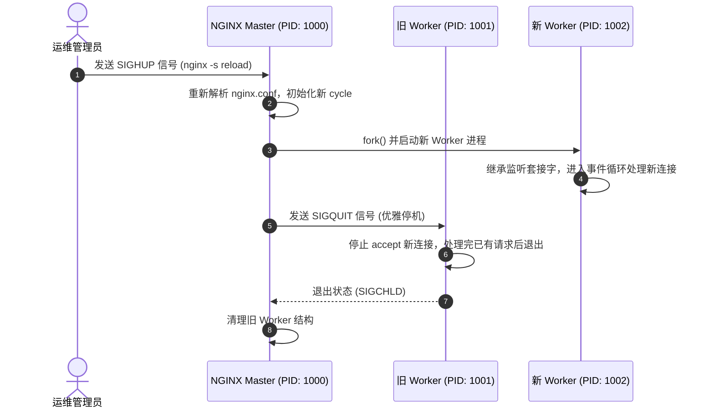
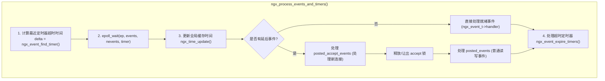
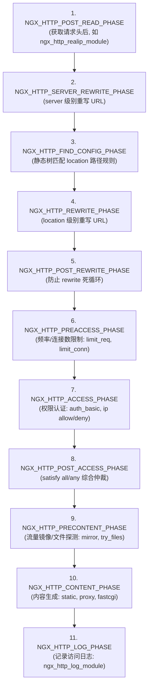

# NGINX 源码与高并发架构全景学习指南

> **适用对象**：C/C++ 开发者、Linux 后端工程师、系统架构师、运维/SRE 工程师及技术求职者  
> **学习目标**：从零构建对 NGINX 底层设计、高并发事件模型、多进程生命周期、HTTP 处理流水线及生产调优的系统性掌握。

---

## 🗺️ 目录导航

1. [前置知识体系与依赖路径](#-前置知识体系与依赖路径)
2. [NGINX 源码整体目录结构速查](#-nginx-源码整体目录结构速查)
3. [九阶段渐进式学习规划](#-九阶段渐进式学习规划)
   - [阶段 0：环境搭建、源码编译与调试套件 (3 天)](#阶段-0环境搭建源码编译与调试套件)
   - [阶段 1：底层核心数据结构与内存池体系 (7 天)](#阶段-1底层核心数据结构与内存池体系)
   - [阶段 2：多进程架构与进程生命周期管理 (7 天)](#阶段-2多进程架构与进程生命周期管理)
   - [阶段 3：事件驱动模型与 I/O 多路复用核心 (8 天)](#阶段-3事件驱动模型与-io-多路复用核心)
   - [阶段 4：模块化设计体系与配置解析引擎 (7 天)](#阶段-4模块化设计体系与配置解析引擎)
   - [阶段 5：HTTP 协议栈与 11 大处理阶段 (10 天)](#阶段-5http-协议栈与-11-大处理阶段)
   - [阶段 6：Upstream 反向代理、负载均衡与缓存体系 (8 天)](#阶段-6upstream-反向代理负载均衡与缓存体系)
   - [阶段 7：现代扩展、异步 AIO/线程池与自研模块 (8 天)](#阶段-7现代扩展异步-aio线程池与自研模块)
   - [阶段 8：生产级性能调优与高可用架构 (7 天)](#阶段-8生产级性能调优与高可用架构)
4. [🔥 面试重点与硬核难点突破 (20+ 高频核心考点)](#-面试重点与硬核难点突破)
5. [🛠️ 源码精读辅助工具与调试技巧](#️-源码精读辅助工具与调试技巧)
6. [📚 经典书目与进阶资源推荐](#-经典书目与进阶资源推荐)

---

## 🧩 前置知识体系与依赖路径

在深入 NGINX 源码前，建议具备或同步补充以下基础，掌握这些前置知识将使你的源码阅读事半功倍：



---

## 📂 NGINX 源码整体目录结构速查

NGINX 代码高度模块化，各子目录职责界限清晰：

```
nginx/
├── auto/                     # configure 脚本依赖的编译配置及 OS 特性探测逻辑
│   ├── cc/                   # 针对不同编译器（gcc, clang, msvc）的编译选项
│   ├── os/                   # 各操作系统特性探测（linux, freebsd, darwin 等）
│   └── modules               # 模块自动加载与配置生成
├── conf/                     # 默认配置文件范本 (nginx.conf, mime.types 等)
├── src/
│   ├── core/                 # 核心基础设施：内存池、字符串、基础数据结构、全局 cycle 等
│   ├── event/                # 事件驱动层：epoll/kqueue 封装、连接池、定时器、SSL、QUIC
│   │   └── modules/          # I/O 多路复用模块具体实现 (ngx_epoll_module.c 等)
│   ├── http/                 # HTTP 协议处理核心与标准模块
│   │   ├── modules/          # HTTP 官方功能模块 (proxy, rewrite, gzip, limit_req 等)
│   │   ├── v2/               # HTTP/2 协议实现
│   │   └── v3/               # HTTP/3 (QUIC) 协议实现
│   ├── mail/                 # 邮件代理模块 (POP3, IMAP, SMTP)
│   ├── stream/               # 四层 TCP/UDP 流代理模块
│   └── os/
│       ├── unix/             # UNIX/Linux 系统调用封装（进程、套接字、共享内存、AIO、sendfile）
│       └── win32/            # Windows 平台适配层
```

---

## 🚀 九阶段渐进式学习规划

---

### 阶段 0：环境搭建、源码编译与调试套件

- **⏱️ 建议用时**：3 天
- **🎯 阶段目标**：掌握 NGINX 编译构建流程，构建带调试符号的 Debug 可执行文件，搭建 GDB/LLDB/VS Code 单步断点调试环境。
- **🧩 前置要求**：掌握 Linux 基本命令、GCC/Clang 编译器基本参数、Make 工具。

#### 1. 核心任务
1. **带调试符号配置与编译**：
   ```bash
   # 在 nginx 根目录下执行
   ./auto/configure \
       --prefix=/usr/local/nginx-debug \
       --with-debug \
       --with-cc-opt="-O0 -g -fsanitize=address" \
       --with-http_ssl_module \
       --with-http_v2_module \
       --with-http_stub_status_module

   make -j$(nproc)
   ```
2. **配置单进程调试模式**：
   在 `nginx.conf` 中显式设置以下指令，避免多进程 fork 对调试器跟踪带来的干扰：
   ```nginx
   daemon off;             # 关闭守护进程模式，前台运行
   master_process off;     # 关闭 Master 进程，只在单进程中执行全部逻辑
   worker_processes 1;
   error_log logs/error.log debug;
   ```
3. **VS Code 调试配置 (`.vscode/launch.json`)**：
   ```json
   {
       "version": "0.2.0",
       "configurations": [
           {
               "name": "Debug Nginx (Single Process)",
               "type": "cppdbg",
               "request": "launch",
               "program": "${workspaceFolder}/objs/nginx",
               "args": ["-c", "${workspaceFolder}/conf/nginx.conf"],
               "stopAtEntry": false,
               "cwd": "${workspaceFolder}",
               "environment": [],
               "externalConsole": false,
               "MIMode": "lldb" // Linux 环境使用 gdb，macOS 环境使用 lldb
           }
       ]
   }
   ```

#### 2. 重点源码入口
- [`src/core/nginx.c`](file:///Users/robot/code/nginx/src/core/nginx.c)（`main()` 函数入口，包含参数解析、全局 cycle 初始化、进程模型启动）

---

### 阶段 1：底层核心数据结构与内存池体系

- **⏱️ 建议用时**：7 天
- **🎯 阶段目标**：掌握 NGINX 高性能、零内存碎片、无内存泄漏的底层数据结构与内存管理哲学。
- **🧩 前置要求**：深入理解 C 语言指针偏移、结构体对齐、动态内存分配。

#### 1. 核心知识点与源码映射



| 数据结构 | 源码文件 | 设计精粹与用途 |
| :--- | :--- | :--- |
| **内存池** (`ngx_pool_t`) | [`ngx_palloc.h`](file:///Users/robot/code/nginx/src/core/ngx_palloc.h) / [`ngx_palloc.c`](file:///Users/robot/code/nginx/src/core/ngx_palloc.c) | 区分小块内存（连续紧凑分配）与大块内存（独立挂载），生命周期随请求结束整块销毁，彻底避免碎片与泄露 |
| **带长度字符串** (`ngx_str_t`) | [`ngx_string.h`](file:///Users/robot/code/nginx/src/core/ngx_string.h) / [`ngx_string.c`](file:///Users/robot/code/nginx/src/core/ngx_string.c) | 结构体包含 `len` 和 `data`，支持直接指向原始内存切片（无需复制字符串），避免 `strlen` 开销 |
| **动态数组** (`ngx_array_t`) | [`ngx_array.h`](file:///Users/robot/code/nginx/src/core/ngx_array.h) / [`ngx_array.c`](file:///Users/robot/code/nginx/src/core/ngx_array.c) | 在内存池中分配连续数组空间，支持倍容扩容 |
| **单向链表数组** (`ngx_list_t`) | [`ngx_list.h`](file:///Users/robot/code/nginx/src/core/ngx_list.h) / [`ngx_list.c`](file:///Users/robot/code/nginx/src/core/ngx_list.c) | 数组组成的单向链表（块状链表），用于高频追加的 HTTP Header 存储 |
| **侵入式双向链表** (`ngx_queue_t`) | [`ngx_queue.h`](file:///Users/robot/code/nginx/src/core/ngx_queue.h) / [`ngx_queue.c`](file:///Users/robot/code/nginx/src/core/ngx_queue.c) | 不包含数据指针，通过 `offsetof` 宏计算外部宿主结构体地址，零内存分配开销 |
| **红黑树** (`ngx_rbtree_t`) | [`ngx_rbtree.h`](file:///Users/robot/code/nginx/src/core/ngx_rbtree.h) / [`ngx_rbtree.c`](file:///Users/robot/code/nginx/src/core/ngx_rbtree.c) | 支持相同 key 插入的红黑树，核心用于事件定时器管理、缓存索引 |
| **通配符哈希表** (`ngx_hash_t`) | [`ngx_hash.h`](file:///Users/robot/code/nginx/src/core/ngx_hash.h) / [`ngx_hash.c`](file:///Users/robot/code/nginx/src/core/ngx_hash.c) | 针对静态配置的完美哈希表，支持前缀/后缀通配符（如 `*.example.com`） |
| **基数树** (`ngx_radix_tree_t`) | [`ngx_radix_tree.h`](file:///Users/robot/code/nginx/src/core/ngx_radix_tree.h) / [`ngx_radix_tree.c`](file:///Users/robot/code/nginx/src/core/ngx_radix_tree.c) | 针对 IPv4/IPv6 路由与访问控制的最长前缀匹配树 |
| **缓冲与链表** (`ngx_buf_t` / `ngx_chain_t`) | [`ngx_buf.h`](file:///Users/robot/code/nginx/src/core/ngx_buf.h) / [`ngx_buf.c`](file:///Users/robot/code/nginx/src/core/ngx_buf.c) | 内存数据与磁盘文件的通用表示，支持流式管道（Pipeline）与零拷贝传递 |

#### 2. 实战任务
- 编写独立测试程序调用 `ngx_palloc.c` 中的函数，验证分配大小阈值 `pool->max` 切换到大块内存分配的临界行为。
- 使用 GDB 断点观察 `ngx_queue_t` 的 `ngx_queue_data` 宏如何通过结构体成员地址反向计算宿主结构体指针。

---

### 阶段 2：多进程架构与进程生命周期管理

- **⏱️ 建议用时**：7 天
- **🎯 阶段目标**：掌握 Master-Worker 经典多进程模型、信号驱动控制流、平滑重启（Reload）与二进制热升级原理。
- **🧩 前置要求**：Linux 进程创建与销毁 (`fork`, `execve`, `waitpid`)、信号处理机制 (`sigaction`)、套接字继承。

#### 1. 架构流程与核心源码



- **Master 进程主循环**：[`src/os/unix/ngx_process_cycle.c:ngx_master_process_cycle()`](file:///Users/robot/code/nginx/src/os/unix/ngx_process_cycle.c)
  - 通过 `sigsuspend()` 挂起阻塞等待信号，响应 `SIGHUP` (重载), `SIGUSR1` (切日志), `SIGUSR2` (热升级), `SIGWINCH` (下线 Worker), `SIGTERM`/`SIGQUIT` (停机)。
- **Worker 进程主循环**：[`src/os/unix/ngx_process_cycle.c:ngx_worker_process_cycle()`](file:///Users/robot/code/nginx/src/os/unix/ngx_process_cycle.c)
  - 调用 `ngx_process_events_and_timers()` 持续循环驱动事件。
- **进程间通信 (IPC)**：[`src/os/unix/ngx_channel.c`](file:///Users/robot/code/nginx/src/os/unix/ngx_channel.c)
  - 通过 `socketpair` 建立一对全双工 Unix Domain Socket 管道，用于 Master 向 Worker 同步状态与指令。
- **共享内存与 Slab 分配器**：[`src/core/ngx_slab.c`](file:///Users/robot/code/nginx/src/core/ngx_slab.c) / [`src/core/ngx_shmtx.c`](file:///Users/robot/code/nginx/src/core/ngx_shmtx.c)
  - 基于 Page 和 Slot 的伙伴系统内存管理，配合自旋锁（`ngx_spinlock.c`）保护跨 Worker 共享数据（如限流、缓存索引、SSL 共享会话）。

---

### 阶段 3：事件驱动模型与 I/O 多路复用核心

- **⏱️ 建议用时**：8 天
- **🎯 阶段目标**：掌握基于 Epoll 的 Reactor 事件模型、连接池预分配、惊群问题解决方案以及高性能毫秒级定时器。
- **🧩 前置要求**：Linux `epoll_create`, `epoll_ctl`, `epoll_wait` 底层机制与系统调用开销。

#### 1. 核心知识点与源码映射



- **事件框架核心调度**：[`src/event/ngx_event.c`](file:///Users/robot/code/nginx/src/event/ngx_event.c)
- **Epoll 模块实现**：[`src/event/modules/ngx_epoll_module.c`](file:///Users/robot/code/nginx/src/event/modules/ngx_epoll_module.c)
- **连接池结构**：`cycle->connections`、`cycle->read_events`、`cycle->write_events` 在初始化时连续分配，利用数组下标直接关联，实现 $O(1)$ 时间复杂度的连接获取。
- **惊群问题（Thundering Herd）演进**：
  1. *传统方案*：`accept_mutex`（[`src/event/ngx_event_accept.c`](file:///Users/robot/code/nginx/src/event/ngx_event_accept.c)），多个 Worker 通过共享内存原子变量抢锁，只有抢到锁的 Worker 才将监听 fd 加入 epoll。
  2. *现代方案*：Linux 3.9+ 内核 `SO_REUSEPORT`，每个 Worker 独立创建监听 socket 并由内核实现负载均衡，彻底废弃 `accept_mutex`。
- **定时器实现**：[`src/event/ngx_event_timer.c`](file:///Users/robot/code/nginx/src/event/ngx_event_timer.c)
  - 所有超时事件（如读超时、连接超时、Keep-Alive 超时）作为节点挂载到红黑树中，根节点的超时时间作为 `epoll_wait` 的超时传参。
- **时间缓存优化**：[`src/core/ngx_times.c`](file:///Users/robot/code/nginx/src/core/ngx_times.c)
  - 避免每次处理事件时调用 `gettimeofday()` 系统调用，仅在每次 `epoll_wait` 返回后批量更新全局时间缓存指针。

---

### 阶段 4：模块化设计体系与配置解析引擎

- **⏱️ 建议用时**：7 天
- **🎯 阶段目标**：掌握 NGINX 模块化对象模型、配置文件的逐行分块解析状态机、三级上下文（Main, Server, Location）的继承与合并规则。
- **🧩 前置要求**：理解 C 语言结构体嵌套、面向对象思想在 C 语言中的实现（函数指针表）。

#### 1. 模块核心结构

每个模块由 [`src/core/ngx_module.h:ngx_module_t`](file:///Users/robot/code/nginx/src/core/ngx_module.h) 定义：

```c
struct ngx_module_s {
    ngx_uint_t            ctx_index;      // 同类模块内部索引
    ngx_uint_t            index;          // 全局模块索引
    void                 *ctx;            // 模块上下文（如 ngx_http_module_t）
    ngx_command_t        *commands;       // 模块支持的配置指令数组
    ngx_uint_t            type;           // 模块类型 (NGX_CORE_MODULE, NGX_HTTP_MODULE, NGX_EVENT_MODULE 等)
    ngx_int_t           (*init_master)(ngx_log_t *log);
    ngx_int_t           (*init_module)(ngx_cycle_t *cycle);
    ngx_int_t           (*init_process)(ngx_cycle_t *cycle);
    ngx_int_t           (*init_thread)(ngx_cycle_t *cycle);
    void                (*exit_thread)(ngx_cycle_t *cycle);
    void                (*exit_process)(ngx_cycle_t *cycle);
    void                (*exit_master)(ngx_cycle_t *cycle);
};
```

#### 2. HTTP 配置三级继承与合并机制
- HTTP 模块具有 8 个配置回调（`create_main_conf`, `init_main_conf`, `create_srv_conf`, `merge_srv_conf`, `create_loc_conf`, `merge_loc_conf` 等）。
- 源码核心实现：[`src/http/ngx_http.c:ngx_http_merge_servers()`](file:///Users/robot/code/nginx/src/http/ngx_http.c) 与 [`src/http/ngx_http.c:ngx_http_merge_locations()`](file:///Users/robot/code/nginx/src/http/ngx_http.c)。
- 指令解析引擎：[`src/core/ngx_conf_file.c`](file:///Users/robot/code/nginx/src/core/ngx_conf_file.c)。

---

### 阶段 5：HTTP 协议栈与 11 大处理阶段

- **⏱️ 建议用时**：10 天
- **🎯 阶段目标**：掌握 HTTP 请求生命周期、状态机无损解析、11 个处理阶段的流水线架构与 Filter 过滤链机制。
- **🧩 前置要求**：HTTP/1.1 RFC 协议规范（请求行、请求头、Transfer-Encoding、状态码）。

#### 1. HTTP 11 大处理阶段流水线



#### 2. 核心源码路径
- **请求解析状态机**：[`src/http/ngx_http_parse.c`](file:///Users/robot/code/nginx/src/http/ngx_http_parse.c)
- **请求生命周期管理**：[`src/http/ngx_http_request.c`](file:///Users/robot/code/nginx/src/http/ngx_http_request.c)
- **阶段初始化与执行引擎**：[`src/http/ngx_http_core_module.c:ngx_http_core_run_phases()`](file:///Users/robot/code/nginx/src/http/ngx_http_core_module.c)
- **Location 匹配算法**：[`src/http/ngx_http_core_module.c:ngx_http_core_find_location()`](file:///Users/robot/code/nginx/src/http/ngx_http_core_module.c)（前缀树二分查找 + 正则链表回溯）

#### 3. 过滤链机制（Filter Chain）
- 响应头过滤链：`ngx_http_top_header_filter`
- 响应体过滤链：`ngx_http_top_body_filter`
- 模块通过向全局函数指针前插入自身（Hook 机制）形成单向链表，如：
  `ngx_http_not_modified_filter` -> `ngx_http_range_filter` -> `ngx_http_gzip_filter` -> `ngx_http_chunked_filter` -> `ngx_http_write_filter`。
- 源码实现：[`src/http/ngx_http_header_filter_module.c`](file:///Users/robot/code/nginx/src/http/ngx_http_header_filter_module.c) 与 [`src/http/ngx_http_write_filter_module.c`](file:///Users/robot/code/nginx/src/http/ngx_http_write_filter_module.c)。

---

### 阶段 6：Upstream 反向代理、负载均衡与缓存体系

- **⏱️ 建议用时**：8 天
- **🎯 阶段目标**：掌握 Upstream 状态机、与上游后端服务器的异步非阻塞连接流、四大负载均衡算法以及文件缓存系统。
- **🧩 前置要求**：理解反向代理概念、一致性哈希算法、LRU 淘汰算法。

#### 1. 核心架构与源码映射

| 核心组件 | 关键源码文件 | 功能原理与要点 |
| :--- | :--- | :--- |
| **Upstream 核心引擎** | [`ngx_http_upstream.c`](file:///Users/robot/code/nginx/src/http/ngx_http_upstream.c) | 处理与后端的非阻塞建立连接、接收响应头、转发生命周期 |
| **加权轮询 (WRR)** | [`ngx_http_upstream_round_robin.c`](file:///Users/robot/code/nginx/src/http/ngx_http_upstream_round_robin.c) | 平滑加权轮询算法（Smooth Weighted Round-Robin），动态调节权重避免单节点被打崩 |
| **IP 哈希 / 一致性哈希** | [`ngx_http_upstream_ip_hash_module.c`](file:///Users/robot/code/nginx/src/http/modules/ngx_http_upstream_ip_hash_module.c) / [`ngx_http_upstream_hash_module.c`](file:///Users/robot/code/nginx/src/http/modules/ngx_http_upstream_hash_module.c) | 基于客户端 IP 或自定义 Key 的哈希路由，保障会话粘性 |
| **最小连接数** | [`ngx_http_upstream_least_conn_module.c`](file:///Users/robot/code/nginx/src/http/modules/ngx_http_upstream_least_conn_module.c) | 优先选择活跃连接数与权重比值最小的节点 |
| **长连接池 (Keepalive)** | [`ngx_http_upstream_keepalive_module.c`](file:///Users/robot/code/nginx/src/http/modules/ngx_http_upstream_keepalive_module.c) | 缓存与后端的 TCP 空闲连接，复用连接减少 TCP 握手开销 |
| **HTTP 文件缓存** | [`ngx_http_file_cache.c`](file:///Users/robot/code/nginx/src/http/ngx_http_file_cache.c) | 共享内存红黑树与双向链表管理元数据，磁盘二级目录存储 Body，支持 `proxy_cache_use_stale` 与 `proxy_cache_lock` |

---

### 阶段 7：现代扩展、异步 AIO/线程池与自研模块

- **⏱️ 建议用时**：8 天
- **🎯 阶段目标**：掌握磁盘 I/O 阻塞的破局点（AIO 与线程池）、零拷贝技术、HTTP/2/3 架构，并动手编写一个自研 HTTP 模块。
- **🧩 前置要求**：理解阻塞系统调用对单线程 Event Loop 的危害，Linux AIO / `io_uring`，POSIX 多线程。

#### 1. 核心关键技术
- **线程池卸载磁盘 I/O**：[`src/core/ngx_thread_pool.c`](file:///Users/robot/code/nginx/src/core/ngx_thread_pool.c)
  - 通过 `aio threads` 指令将阻塞的 `read()`/`write()` 卸载至后台线程池，执行完毕通过 `eventfd` 唤醒 Worker 主事件循环。
- **零拷贝核心**：[`src/os/unix/ngx_linux_sendfile_chain.c`](file:///Users/robot/code/nginx/src/os/unix/ngx_linux_sendfile_chain.c)
  - 结合 `sendfile`、`tcp_nopush` (开启 `TCP_CORK`) 与 `tcp_nodelay` 实现数据从内核磁盘缓冲区直接发往网卡，全程无用户态拷贝。
- **HTTP/2 协议实现**：[`src/http/v2/`](file:///Users/robot/code/nginx/src/http/v2/)（二进制帧分发、HPACK 头部压缩、流优先级）
- **HTTP/3 & QUIC 协议**：[`src/http/v3/`](file:///Users/robot/code/nginx/src/http/v3/) 与 [`src/event/quic/`](file:///Users/robot/code/nginx/src/event/quic/)（基于 UDP 的抗丢包队头阻塞、0-RTT 握手、连接迁移）

#### 2. 实战任务：编写自定义 HTTP 模块
按照标准规范编写一个包含指令、Handler 和配置合并的自定义 C 模块（例如实现一个动态修改响应体内容的过滤模块或自定义 Token 校验模块）。

---

### 阶段 8：生产级性能调优与高可用架构

- **⏱️ 建议用时**：7 天
- **🎯 阶段目标**：具备将 NGINX 推向百万并发极限的调优能力，掌握内核参数协同优化与高可用容灾架构。
- **🧩 前置要求**：Linux 内核网络协议栈参数体系 (`sysctl`)。

#### 1. 极致性能调优清单

```nginx
# 进程与 CPU 亲和度
worker_processes auto;
worker_cpu_affinity auto;
worker_rlimit_nofile 1048576;   # 突破系统最大打开文件描述符限制

events {
    use epoll;
    worker_connections 65535;   # 单 Worker 最大连接数
    multi_accept on;            # 一次事件循环尽可能接收全部就绪连接
}

http {
    # 零拷贝与网络传输优化
    sendfile on;
    tcp_nopush on;              # 聚合数据包发送，提升带宽利用率
    tcp_nodelay on;             # 禁用 Nagle 算法，降低延迟

    # 连接保活
    keepalive_timeout 65;
    keepalive_requests 10000;

    # 客户端缓冲区保护
    client_body_buffer_size 128k;
    client_max_body_size 10m;
    client_header_buffer_size 4k;
    large_client_header_buffers 4 16k;

    # 压缩优化
    gzip on;
    gzip_min_length 1k;
    gzip_comp_level 5;
    gzip_types text/plain application/json application/javascript text/css;

    # 限流防刷 (漏桶与令牌桶)
    limit_req_zone $binary_remote_addr zone=req_per_ip:10m rate=50r/s;
    limit_conn_zone $binary_remote_addr zone=conn_per_ip:10m;
}
```

#### 2. Linux 内核网络参数协同优化 (`/etc/sysctl.conf`)
```ini
fs.file-max = 2097152
net.core.somaxconn = 65535          # 提升 listen 队列上限
net.ipv4.tcp_max_syn_backlog = 65535 # 提升半连接队列上限
net.ipv4.tcp_tw_reuse = 1            # 安全复用 TIME_WAIT 套接字
net.ipv4.tcp_fin_timeout = 15        # 加快孤儿连接释放
net.ipv4.ip_local_port_range = 1024 65535 # 扩大对外连接端口范围
```

#### 3. 高可用架构方案
- **L4/L7 组合架构**：DNS 轮询 / BGP Anycast -> LVS / F5 / DPDK 负载均衡 -> NGINX 集群 -> 业务微服务集群。
- **双机热备**：NGINX + Keepalived (VRRP 协议) 实现 VIP 秒级漂移。

---

## 🔥 面试重点与硬核难点突破

以下是互联网大厂与高并发系统岗位的经典高频考点，涵盖架构哲学、底层细节与排错攻防：

### 1. 为什么 NGINX 采用多进程模型而不是多线程模型？
> **深度解答要点**：
> 1. **稳定性与隔离性**：Worker 进程相互独立，若某个 Worker 发生内存越界、段错误（Segmentation Fault）崩溃，Master 捕获 `SIGCHLD` 可瞬间拉起新进程，不影响其他 Worker 处理流量；多线程则单个线程崩溃会导致全进程退出。
> 2. **无锁与极低上下文切换开销**：每个 Worker 独占一个 CPU 核心并绑定亲和度，事件循环内单线程无锁无竞争运行，避免多线程频繁的锁争用（Lock Contention）与 CPU 寄存器切换。
> 3. **便于热升级与热重载**：多进程模型下新老 Worker 可以天然共存，老 Worker 优雅退出，新 Worker 平滑接管套接字。

### 2. NGINX 是如何做到平滑重启（Reload）和热升级（Hot Upgrade）的？
> **深度解答要点**：
> - **Reload 原理**：Master 收到 `SIGHUP` 信号后，重新校验解析配置并构建新 `ngx_cycle_t`，然后 `fork` 出一批加载新配置的 Worker。随后向旧 Worker 发送 `SIGQUIT` 信号，旧 Worker 停止监听并处理完手头未完成的请求后正常退出。
> - **热升级原理**：
>   1. 替换旧 nginx 二进制文件，向旧 Master 发送 `SIGUSR2` 信号。
>   2. 旧 Master 将监听 socket 的文件描述符写入环境变量（`NGINX` 变量），调用 `execve()` 启动新版本的 Master 进程。
>   3. 新 Master 启动后从环境变量继承这些监听文件描述符，直接开始接收新连接。
>   4. 运维向旧 Master 发送 `SIGWINCH` 停掉旧 Worker，验证无误后向旧 Master 发送 `SIGQUIT` 完成平滑交接。若出现问题可发送 `SIGHUP` 迅速回滚。

### 3. NGINX 中的“惊群”问题是什么？历史上是如何演进解决的？
> **深度解答要点**：
> - **现象**：多个 Worker 同时监听同一个端口，当一个新连接到来时，操作系统内核唤醒所有休眠在 `epoll_wait` 上的 Worker，但最终只有一个 Worker `accept()` 成功，其余返回 `EAGAIN`，造成无效的 CPU 上下文切换震荡。
> - **NGINX 的解决方案演进**：
>   1. **早期用户态锁方案 (`accept_mutex`)**：通过共享内存实现自旋互斥锁。只有拿到锁的 Worker 才将监听套接字加入 epoll，同时配合 `ngx_posted_accept_events` 延后队列，在释放锁后再处理具体 I/O，防止长占锁导致负载不均。
>   2. **现代内核级方案 (`SO_REUSEPORT`)**：Linux 3.9+ 引入套接字选项，每个 Worker 独立 `bind/listen` 同一个端口，由内核在硬件/网络层利用四元组哈希均匀分发连接，彻底解决惊群且具备极致吞吐。

### 4. 详细阐述 NGINX 的 Location 匹配优先级规则与算法
> **深度解答要点**：
> 优先级由高到低严格如下：
> 1. **绝对精确匹配**：`location = /path`（匹配成功立即停止搜索）。
> 2. **前缀优先匹配**：`location ^~ /path`（前缀匹配成功后，不再检查正则匹配）。
> 3. **正则表达式匹配**：`location ~ /pattern`（区分大小写）或 `location ~* /pattern`（不区分大小写）。按配置文件中**自上而下的出现顺序**匹配，命中第一个即终止。
> 4. **最长普通前缀匹配**：`location /path`（若无任何正则命中，取匹配长度最长的前缀配置）。
> - **底层实现**：普通前缀字符串在配置加载阶段被构建为静态前缀三叉搜索树（Trie / Radix Tree），查询时间复杂度接近 $O(1)$。

### 5. NGINX 内存池 `ngx_pool_t` 的设计精髓是什么？有何优缺点？
> **深度解答要点**：
> - **设计精髓**：
>   1. **统一生命周期管理**：将零散的多次 `malloc` 聚合为一大块连续内存池，对象直接以指针偏移方式分配。在整个请求结束时调用 `ngx_destroy_pool()` 一次性全量释放，无需跟踪每个子对象的生命周期，彻底消灭内存泄漏。
>   2. **大小对象分流**：小于 `pool->max` 的小块内存直接在当前 pool page 尾部移动指针分配；大于 `pool->max` 的大块内存单独调用 `ngx_alloc` 分配并挂载到 `pool->large` 链表。
> - **优缺点权衡**：
>   - *优点*：分配速度极快（仅指针加法）、零内存碎片、无内存泄漏隐患。
>   - *缺点*：不支持单块小内存的提前精准释放（只增不减，直至池销毁），因此不适用于生命周期超长或内存无限增长的流式场景（长生命周期对象需使用 `ngx_slab_pool_t` 或独立大块管理）。

### 6. NGINX 平滑加权轮询（Smooth Weighted Round-Robin）算法原理
> **深度解答要点**：
> 设有后端节点集合，每个节点有固定配置权重 $W$ 和动态有效当前权重 $CW$（初始为 0）。
> 1. 每次调度时，令每个节点的 $CW = CW + W$。
> 2. 选出当前 $CW$ 最大的节点作为本次转发目标。
> 3. 将所选节点的 $CW$ 减去所有节点的权重总和 $\sum W$。
> - **优点**：调度序列极其平滑分散（例如权重比为 5:1:1 时，输出序列为 `A, A, B, A, C, A, A` 而非聚集在前面的 `A, A, A, A, A, B, C`），避免突发流量把高权重节点瞬时打垮。

### 7. 什么是 11 个 HTTP 处理阶段？为什么不能把所有逻辑写在一个阶段里？
> **深度解答要点**：
> - 11 个阶段构建了标准化的中间件流水线（Pipeline），实现了请求解析、URL 改写、安全鉴权、限流防刷、内容生成、日志审计的完全解耦。
> - 模块开发者只需将 Handler 挂载在特定阶段（如 `limit_req` 挂在 `PREACCESS` 阶段，`auth_basic` 挂在 `ACCESS` 阶段），保证了执行次序的严格确定性与模块间无缝协作。

### 8. 当一个 Worker 进程遇到阻塞型磁盘 I/O 时会发生什么？NGINX 是如何解决的？
> **深度解答要点**：
> - **危害**：由于 Worker 是单线程事件循环，一旦同步读取大文件命中磁盘阻塞，整个 Worker 将被挂起（处于 `D` 状态），该 Worker 上承载的成千上万个并发网络事件都无法被处理，导致网络延迟陡增。
> - **解法**：
>   1. **开启异步 AIO 与线程池 (`aio threads`)**：NGINX 将阻塞的磁盘读写操作包装为任务投递到后台专用 Worker Thread Pool，主线程立刻返回继续执行 `epoll_wait`；磁盘数据读取完毕后，子线程通过 `eventfd` 产生读事件唤醒主 Worker 线程。
>   2. **零拷贝 `sendfile`**：对于静态文件直接通过内核调用在内核态完成文件到 socket 的传输。

---

## 🛠️ 源码精读辅助工具与调试技巧

1. **GDB/LLDB 高频断点定位表**：
   - 监听接收新连接：`b ngx_event_accept`
   - 开始处理 HTTP 请求行：`b ngx_http_process_request_line`
   - 开始处理 HTTP 请求头：`b ngx_http_process_request_headers`
   - 进入 11 阶段流水线：`b ngx_http_core_run_phases`
   - Location 规则匹配：`b ngx_http_core_find_location`
   - Upstream 连接后端：`b ngx_http_upstream_connect`
   - 响应数据输出：`b ngx_http_write_filter`

2. **动态追踪与性能观测**：
   - **`bpftrace` 观测 Worker 事件循环延迟**：
     ```bash
     bpftrace -e 'tracepoint:syscalls:sys_enter_epoll_wait { @start[pid] = nsecs; } tracepoint:syscalls:sys_exit_epoll_wait /@start[pid]/ { @dur = hist((nsecs - @start[pid])/1000); delete(@start[pid]); }'
     ```
   - **`perf` 生成火焰图**：
     ```bash
     perf record -F 99 -p $(pgrep -f "nginx: worker") -g -- sleep 30
     perf script | stackcollapse-perf.pl | flamegraph.pl > nginx_perf.svg
     ```

3. **并发压力测试套件**：
   - `wrk -t8 -c1000 -d60s --latency http://127.0.0.1/`

---

## 📚 经典书目与进阶资源推荐

1. **经典书籍**：
   - 《深入理解 Nginx：模块开发与架构解析》（陶辉 著）—— 华语区 NGINX 源码剖析标杆之作。
   - 《深入剖析 Nginx》（高群凯 著）—— 侧重底层数据结构与设计模式。
   - 《Mastering NGINX》（Dimitri Aivaliotis 著）—— 侧重生产级配置、调优与架构。
   - 《UNIX 网络编程 卷1：套接字联网 API》（W. Richard Stevens 著）—— 网络编程圣经。
2. **官方文档与源码**：
   - [NGINX 官方开发指南 (Development Guide)](https://nginx.org/en/docs/dev/development_guide.html)
   - [NGINX 核心源码仓库](https://github.com/nginx/nginx)
